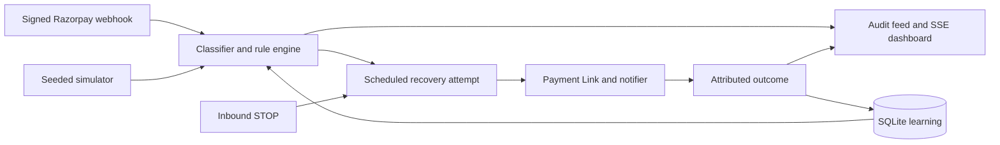

# Razorpay Recovery Agent

Live demo: <URL added after deploy>

Recover failed-payment revenue with a reason-specific, consent-aware agent that invites customers back to Razorpay hosted checkout.

## Why this wins

- Reason-specific recovery, not blind retry: bank outages, expired cards and insufficient funds need different actions.
- Consent-aware outreach: STOP cancels reminders, customer cancellation is respected, and there is no auto-debit.
- Learns per reason × channel × timing, with an auditable rule decision behind every attempt.

## Quickstart

Requires Node.js 22 and npm. The empty credential values in `.env.example` are placeholders, mock mode works without keys. Preserve an existing `.env.local`.

```bash
[ -f .env.local ] || cp .env.example .env.local
npm run setup
npm run simulate -- --n 1000 --seed 42
npm test
npm run build
npm run dev
# In a second terminal, process scheduled reminders:
npm run worker
```

Open http://localhost:3000. `setup` installs dependencies, pushes the Prisma schema and seeds 200 synthetic customers. `npm run demo` combines setup and the exact batch above. CLI simulation rebuilds only its disposable `prisma/simulation.db`, independently of dashboard data in `prisma/dev.db`. Use the dashboard simulator or `POST /api/simulate` to populate the dashboard. API simulations preserve existing data and learning; reset the demo before comparing API runs. Never run two CLI simulations together.

Next development output uses `.next-dev`, production builds use `.next`. `.env.local`, databases and logs are gitignored; `.env.example` is tracked. Configure payment credentials only for intentional live use. Production mutation APIs require `Authorization: Bearer <DEMO_API_TOKEN>` unless `DEMO_PUBLIC=true`.

## Deploy to Render

1. Make this repository available on GitHub, then in Render select **New > Blueprint** and connect it. Render reads [render.yaml](render.yaml) and builds the multi-stage Node.js 22 Docker image with Next standalone output.
2. Keep the Free plan and supplied demo environment defaults. No disk or credentials are required; Render generates `DEMO_API_TOKEN`. Startup pushes the Prisma schema, seeds customers, and runs an instant 1,000-transaction seed-42 simulation into the dashboard database only when it has no transactions.
3. Wait for `/api/stats` to pass its health check, open the assigned URL, and replace the Live demo placeholder above. Confirm the dashboard has 1,000 failures and that the feed connects. Existing transactions survive process restarts only while the local filesystem remains available.

The image retains Prisma CLI and tsx dependencies for startup initialization. It binds to `0.0.0.0` on Render's `PORT`. SSE sends identity encoding, no-transform and no-buffering headers with one-second heartbeats. Blueprint fields follow the [Render reference](https://render.com/docs/blueprint-spec).

## Architecture



## How the agent decides

The deterministic rule engine is primary. Structured gateway reasons take precedence over description, method, source and authentication-step fallbacks. Unknown errors remain `UNKNOWN`.

| Reason | Action |
| --- | --- |
| Insufficient funds | Next 1st–3rd salary window in India time |
| Bank down / UPI app error | Wait 15 minutes, suggest another bank / app |
| OTP timeout / card expired / network drop | Immediate hosted checkout, suggest the relevant alternative |
| Card declined / unknown | One neutral alternative-method reminder after 30 minutes |
| Cart abandoned | Reminder after 30 minutes, at most one final reminder after 24 hours |
| Limit exceeded | Next-day reminder, suggest another account |
| User cancelled / opted out | Refuse outreach |

Missing contacts and expected recovery below 3% also suppress outreach. Other reasons allow at most one reminder. Channel ranking uses `(12 × reason prior + successes) / (12 + successes + failures)` for each reason, channel and timing bucket. Pending and suppressed attempts do not train the model. This is Bayesian ranking of observed outcomes, not a causal lift estimate.

The optional OpenRouter LLM **only polishes customer-facing copy** for the single-failure demo. It cannot change diagnosis, action, channel, timing, probability, consent checks or rule reasoning. Bulk simulations make zero LLM calls. Templates retain name, amount, link and STOP placeholders; calls have a 300-token limit, 10-second timeout, no retries and cached fallback. Generated copy needs merchant review before live messaging.

A recovery is credited only when a sent RecoveryAttempt's matching Payment Link is paid. The attempt records `attribution: PAYMENT_LINK` and the provider payment ID when supplied. Original payment/order success marks the transaction `PAID`, stops follow-ups and earns **zero recovery credit**. Synthetic settlements record `SIMULATED_LINK`. Stats exclude legacy recovered rows without attribution. A generic Payment Link offers merchant-enabled methods; it does not force UPI, create mandates or implement automatic retries, EMI or split payments.

## Reproducible batch, synthetic

Measured with `npm run simulate -- --n 1000 --seed 42`, a clean dedicated simulation database and a fixed virtual epoch of 2026-07-27. These are synthetic customers, mock links, console deliveries and seeded outcomes, not merchant results or measured conversion lift. Stats and simulation responses include `synthetic: true`; mixed dashboard datasets also carry this flag if any source is synthetic.

| Reason | Failed | Attempted | Suppressed | Recovered | Rate | Rupees recovered |
| --- | ---: | ---: | ---: | ---: | ---: | ---: |
| **Total** | **1,000** | **897** | **103** | **331** | **33.1%** | **₹843,779** |
| Insufficient funds | 89 | 87 | 2 | 19 | 21.3% | ₹46,846 |
| Bank down | 89 | 87 | 2 | 62 | 69.7% | ₹154,031 |
| OTP timeout | 89 | 87 | 2 | 49 | 55.1% | ₹125,168 |
| UPI app error | 91 | 90 | 1 | 43 | 47.3% | ₹116,971 |
| Card expired | 95 | 92 | 3 | 27 | 28.4% | ₹70,900 |
| Card declined | 93 | 91 | 2 | 9 | 9.7% | ₹24,706 |
| Network drop | 101 | 99 | 2 | 59 | 58.4% | ₹148,840 |
| Cart abandoned | 90 | 88 | 2 | 33 | 36.7% | ₹79,629 |
| Limit exceeded | 91 | 91 | 0 | 16 | 17.6% | ₹39,919 |
| User cancelled | 85 | 0 | 85 | 0 | 0.0% | ₹0 |
| Unknown | 87 | 85 | 2 | 14 | 16.1% | ₹36,769 |

Attempted counts distinct transactions with a sent reminder; channel counts can include a second cart reminder. Rate is recovered / failed. Money in API responses is integer paise. Full machine-readable evidence: [seed 42 result](docs/simulation-seed-42.json). IDs and feed ingestion timestamps vary across runs; aggregate results and virtual scheduling are reproducible.

## One full trace, synthetic

An actual seed-42 trace for Arjun Nair:

1. **Failure → diagnosis:** a ₹3,349 UPI failure is classified `BANK_DOWN`.
2. **Decision with reasoning:** `BANK_COOLDOWN_ALTERNATE`, WhatsApp, 15-minute wait. The engine explains: “This looks like a temporary bank outage rather than a loss of purchase intent. Allow 15 minutes for the bank to recover, then offer another bank or payment method.” The learned estimate at this point was 69%.
3. **Link:** a persisted mock Payment Link is attached to this RecoveryAttempt. The recorded URL is `https://rzp.io/l/mock_18ed4b35b3ea`, an illustrative mock URL, not a payable checkout.
4. **Nudge:** ConsoleNotifier records: “Namaste Arjun, Chai Point ka ₹3,349.00 ka order abhi complete nahi hua. Bank mein dikkat thi; 15 minute baad doosra bank ya payment method try karein. Secure link: [the attempt link]. Madad chahiye toh store se sampark karein. Reminders band karne ke liye STOP reply karein.” No WhatsApp message is delivered.
5. **Outcome:** virtual payment arrives about 5.7 minutes after the nudge. The attempt records `RECOVERED`, `attribution: SIMULATED_LINK`; ₹3,349 is credited once and its reason/channel/timing success count increases.

**Refusal example:** `POST /api/inbound` with `{"from":"whatsapp:+919000000001","text":"STOP"}` sets the matching customer to `optedOut`, cancels every PENDING attempt and logs `OPT_OUT`. A later OTP failure receives a `none` channel decision. No Payment Link or MessageEvent is created for that new refusal. Tests also change consent between planning and dispatch and verify zero notifier calls. `UNSUBSCRIBE` and `BAND` work case-insensitively, as do form fields `From` and `Body`.

## Razorpay products used

- **Payment Links:** SDK integration creates hosted checkout invitations with automatic provider notifications disabled. Demo traffic always uses mock links.
- **Payments and Orders webhooks:** HMAC-verified failure detection and paid-state reconciliation, including `payment_link.paid` attribution and replay deduplication.
- **Subscriptions webhooks:** `subscription.charged` reconciliation and `subscription.halted` attention events. No subscription creation or automatic collection is implemented.

## API reference

| Endpoint | Purpose |
| --- | --- |
| `GET /api/stats` | Synthetic flag, counts, paise, reason/channel breakdowns, timeline |
| `GET /api/transactions` | Filters: status, reason, channel, limit, cursor |
| `GET /api/transactions/[id]` | Customer, attempts, attribution and audit events |
| `GET /api/agent/feed`, `GET /api/agent/events` | JSON audit feed and SSE stream |
| `GET /api/learning` | Counts, observed rates and insights |
| `POST /api/demo/fail` | `{amountPaise, reason, method, customerId?}` |
| `POST /api/simulate` | `{n, seed?, speed?: "instant" or "live"}`, returns runId |
| `GET /api/simulate/[runId]` | Persisted run progress, synthetic flag |
| `POST /api/agent/run` | Plan failures, dispatch due reminders, settle stale attempts |
| `POST /api/inbound` | JSON `{from,text}` or URL-encoded `From` / `Body` opt-out |
| `POST /api/webhooks/razorpay` | Raw signed Razorpay event, requires webhook secret |
| `POST /api/reset` | Erase demo dataset and learning, reseed customers |

Invalid input returns 400, missing records 404, conflicting runs/reset 409. Signed payment amounts must match. Production inbound integrations must authenticate the provider and forward through an adapter with the bearer token; direct Twilio signature validation is not implemented.

## Implemented, simulated, limitations

| Status | Scope |
| --- | --- |
| Implemented | Eleven-reason rules, durable scheduling, opt-out ingestion and dispatch enforcement, signed webhook verification, deduplication, matching-link attribution, learning, APIs, SSE and dashboard |
| Simulated | Seeded customer failures, recovery outcomes, mock Payment Links and ConsoleNotifier delivery |
| Optional, not live-verified | Real Razorpay link creation and OpenRouter copy polish |
| Limitations | Single merchant, local SQLite and one long-lived server process; no distributed queue/locks, provider outbox, real messaging adapter, provider inbound signature adapter or authenticated read APIs |

The Render blueprint enables `DEMO_PUBLIC=true` for the hackathon: anyone can invoke demo mutation APIs, including reset and inbound opt-out, without the generated token. Use synthetic data only and leave live provider credentials unset. Set `DEMO_PUBLIC=false` to restore the production bearer-token guard. Read APIs remain public. Signed Razorpay webhook verification is unchanged.

Render Free has no persistent disk: database changes are lost on redeploy, restart or spin-down, and the next empty boot recreates the seeded demo. Free services sleep after 15 minutes idle and cold starts include initialization; see [Render Free limitations](https://render.com/docs/free). Run one instance only. The container starts Next, not the optional reminder worker; instant simulations settle their own attempts, while manually scheduled reminders need `POST /api/agent/run` or a separately operated worker.

The worker polls every five seconds. Process crashes can leave stale simulation runs requiring operator reconciliation. Synthetic API outcomes share dashboard learning tables, reset before real traffic. Provider send/DB-commit crash windows need an idempotent production outbox. Opt-out stops future messages; an already-delivered link can still receive a customer-authorized payment. Unknown inbound senders produce an audit event but cannot opt out a customer record that does not yet exist.

## Tests

`npm test`: **3 test files passed, 58 tests passed**. Coverage includes failure classification, reason policies, consent, timing, learning, JSON/form opt-out, dispatch refusal, original-payment non-attribution, matching-link credit, replay protection, amount mismatch and production demo authorization. Integration tests create and remove an isolated temporary SQLite database.

`npm run build` includes lint and TypeScript checks.

## Screenshots

Captured by the design pass:

- [Overview](docs/screenshots/overview.png)
- [Agent feed](docs/screenshots/feed.png)
- [Recoveries](docs/screenshots/recoveries.png)
- [Insights](docs/screenshots/insights.png)
